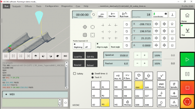
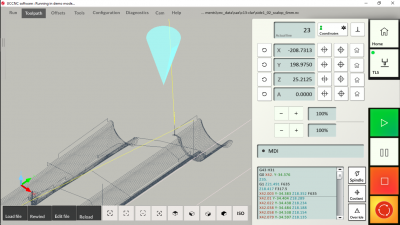

# UCCNC - Screenset: 2046 v0.05
Screenset for UCCNC (from v1.2116) https://cncdrive.com/UCCNC.html initially for the Stepcraft machines like M500, M700, M1000...Q408.. 
and later for other machines too, all controllers the UCCNC supports.

The Actual Screenset release "2046 v0.05" for v1.2116 is much more user friendly but lack the tools > probe UI tab design. If you know you need that stay with the previous release and UCCNC up to v1.2115, the probe screen there is bit more tidy. Or if you want to progress further consider donation or make the adjustments and pull the update back to me.




## Looking for the previous "Screenset_2046" release 
get the release from https://github.com/twentyfortysix/uccnc_screenset_2046/tree/0.04

## Get the UCCNC v1.2116
https://www.cncdrive.com/UCCNC/setup_1.2116.exe

## Why do I put so much effort to make another screenset?
Because the native UI (screenset) is a mess.

The default Screenset just does not follow any UI standarts other than that buttons look like buttons, it is not optimized for touch screens whatsoever most importantly the layout and UI is so clumsy that forces us to stop and think, while we should act already.
Don't take me wrong the UCCNC program it self is a solid program that does its work well, but it must be comfortably controlable too or the bits will break or my brain explodes.

The 2046 screenset is equal in function to what used to be the Stepcraft_M700 in my case is, but redesigned in a way that is more responsive on touch screens, way more readable, uses common UX logic and in general it is cleaner.
Sure not all parts of the program are redesigned, only those that we come in touch the most. 

- RUN
- TOOLPATH 
- JOG screen

All the rest stays the same though some icons might be replaced by the new set here and there too.
The screen looks best on something that has 16:9 resolution, at least 1300px wide or more. 

## Supported controllers

- UC100 :dancer:
- UC300_5LPT :dancer:
- UC400ETH
- UC300_M44
- UC300ETH_5LPT
- UC300_5441
- UC300ETH_5441
- UC300ETH_M44
- UC300ETH_M45
- UC300ETH_UB1
- AXBB

Definition for controllers with :dancer: are tested on real controller. The rest should just work too.

## Status
In production for a while already

## Instalation/s

A. upload and set the screenset in UCCNC program
The package follows the default UCCNC folder paths. Unpack the files to coresponding folders.
```
C:\UCCNC\Flashscreen\BMP\Stepcraft_2046
C:\UCCNC\Screens\Stepcraft_2046.ssf
```


B. upload and profile adjustment
- same like in A.
- Edit C:\UCCNC\Profiles\Default.pro (your profile file may vary) and change the mainscreenfilename entry as follows:
mainscreenfilename=2046

### Font
The Screenset uses Calibri font along the default Arial. If you are on old Windblows you can download the font for free from https://dl.freefontsfamily.com/download/Calibri-Font/, latest Windblows includes it by default.

### 3D view & Gcode colors
The 3D colors and Gcode colors are not part of the screenset, it is part of the profile *.pro
You can either use my profiles you find as a part of this repository
C:\UCCNC\Profiles\Stepcraft_2046.pro
or you can just substitute the Appeareance part in your pofile Profiles/*.pro by the following code


```
[Appearancesetupsettings]
2DTLCmarker=False
Viewerundonepathcolor=-15855082
Viewerdonepathcolor=-5229054
Viewerrapidpathcolor=-256
ViewerTCPmarkercolor=-5767168
ViewerBackgroundcolor=-7895428
Viewerboundariescolor=-342059
GVgcodecolors=-15987700
GVmcodecolors=-233
GVscodecolors=-32513
GVfcodecolors=-21931
GVbackgroundcolor=-12698050
GVactualcodecolor=-16777216
GVactualcodemidlinescolor=-16777216
GVnotinterpretedcodecolor=-10528183
GVaxiswordcolor=-8323328
GVcoordinatecolor=-9250052
TCPcone=True
TCPcross=False
RotateTCPwithplaneselection=False
Showzeromark=True
Zeromarkcolor=-16711681
DROwarningcolor=0
rotationpointmarkcolor=0
Showrotationmark=True
Showtoolpathboundaries=True
Highlightcolor=0
Showmessageonsoftlimits=True
ValidateTextfieldsonEnteronly=True
Disablejogpanelautopopup=False
ShowtoolpathZzeroplate=False
ZplateXextents=100
ZplateYextents=100
ZplateZposition=0
ZplateZpositiononbottom=False
ZplatePlateOpacity=25
ZplateColor=-65536
ZplateXgrid=10
ZplateYgrid=10
ZplateGridOpacity=25
ZplateGridColor=-1
ZplateShowSoftlimits=True
ZplateSoftlimitsColor=-4407121
ZplateSoftlimitsOpacity=100
radiusoffsetpathcolor=0
ShowRcompanalysisonfileload=True
Disablevirtualmousemode=True
Disabletoolpathview=False
ZplateXstart=0
ZplateYstart=0
Savetooltableonclosing=True
Dontresettoolpathviewonreload=True
checkboxfillcolor=0
Showtoolpathdimensions=False
Dontcompressimages=True
tooldimscolor=0
tooldimsaxiscolor=False
GVbasecolor=-4211015
GVnotinterpretedcolor=16711680
GVlinenumberscolor=-7175082
GVcommentscolor=-10526881
GVgcodescolor=0
GVXIcolor=-5953526
GVYJcolor=-16354048
GVZKcolor=-16680569
GVAcolor=0
GVBcolor=0
GVCcolor=0
GVMcolor=0
GVTFScolor=0
Defaultview=viewISO
Lathecenterlinecolor=0
Lathecontourcolor=0
Generatecontourinlatheviewmode=False
Antialiasingsamples=0
```


## Try and run
Ideally just use the Screenset and not the whole profile. The profile has settings for specific machine and that might not fot yours (mine is Stepcraft M700). 
Or once you throw all the files on place, start UCCCNC and change to profile to "2046", restart program.
Run the UCCNC program, go to Configuration > Profiles. Select "2046" profile, click "load profile". The program will quit and restart with the "2046" profile ready to be used & tested.

## The screenset is loaded but the UCCNC stays in RESET mode.
You most likely use the Screenset with my profile. Which is fine in general as you get the color setup for free, but you machine might not like my other settings. In that case open your profile go to Configuration > Apearrance > select screenset. Locate the Screenset only. Save that as extra profile just in case. Load the newly created profile. Voala, Your profile has fancy look now.

## Testing
Although the profile has been tested and looks good, you never know. Be carefull and let me know if there is anything that should be fixed, be it wrong event mappings or design flaws. Fire up github issue and be as desriptive as you can, ideally include screenshots with description.
(Well nobody complained so far)

## I need to update the Screenset for my and others needs
In that case make the appropriate changes and make a pull request and will make the change available to others as well.
Or send it to me over forum https://www.forum.cncdrive.com/viewtopic.php?f=9&t=3731 or somehow ;)

## If you like it so much
You can make the profile as your default by rewriting your UCCNC shortcut to something like - open short cut properties and set target to:
C:\UCCNC\UCCNC.exe /p 2046
which basically says run UCCNC with the profile "2046", that is it.

## Tweak it
Sure, you can add your own buttons, and tweak it to your liking. The "Edit screen" button is in General settings.
Here is how https://youtu.be/_5kHN4LvtGU 

## What if want I the whole program UI be optimized
Well, it takes awefull lot of hours of work which needs to be covered somehow.
Think about it.  

## Moo info
https://www.forum.cncdrive.com/viewtopic.php?f=9&t=3731
