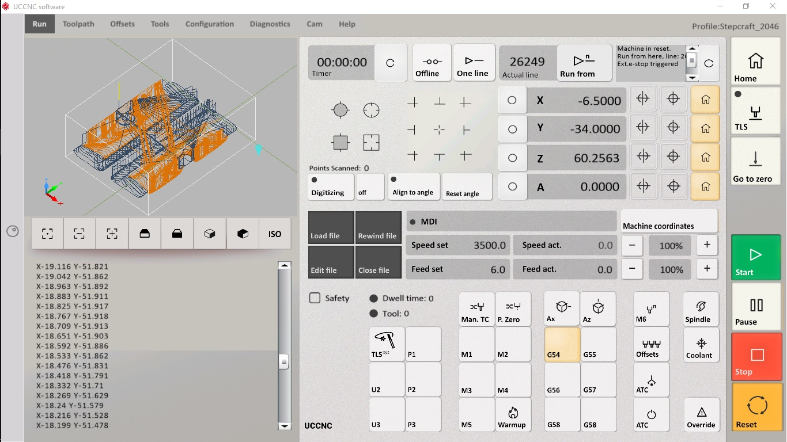
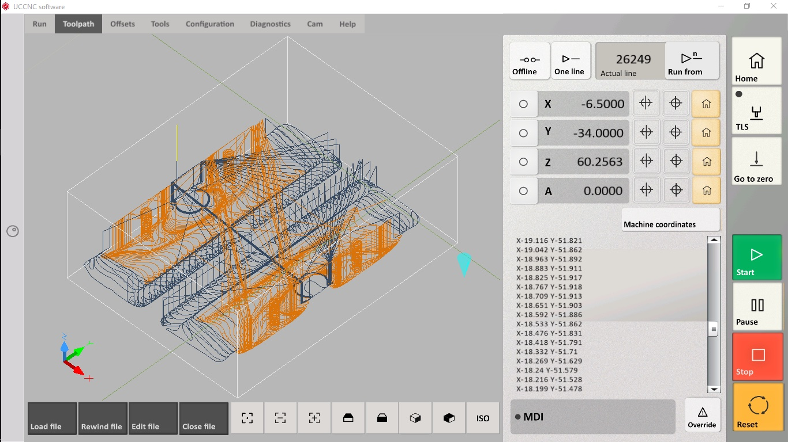

# UCCNC - Screenset 2046
Screenset for UCCNC https://cncdrive.com/UCCNC.html initially for the Stepcraft machines like M500, M700, M1000...
and later for other machines too, at least with UC100 controller or UC300ETH_5LPT and basically all controllers the UCCNC supports.



version v0.04

## Why
Because the native UI (screenset) is a mess.

The default Screenset just does not follow any UI standarts other than that buttons look like buttons, it is not optimized for touch screens whatsoever most importantly the layout and UI is so clumsy that forces us to stop and think, while we should act already.
Don't take me wrong the UCCNC program it self is a solid program that does its work well, but it must be comfortably controlable too or the bits will break or my brain explodes.

The Stepcraft_2046 screenset is equal in function to what the Stepcraft_M700 in my case is, but redesigned in a way that is more responsive on touch screens, way more readable, uses common UX logic and in general it is cleaner.
Sure not all parts of the program are redesigned, only those that we come in touch the most. 

- RUN
- TOOLPATH 
- JOG screen

All the rest stays the same though some icons might be replaced by the new set here and there too.
The screen looks best on something that has 16:9 resolution, at least 1300px wide or more. 

## Supported controllers

- UC100 :dancer:
- UC300_5LPT :dancer:
- UC400ETH
- UC300_M44
- UC300ETH_5LPT
- UC300_5441
- UC300ETH_5441
- UC300ETH_M44
- UC300ETH_M45
- UC300ETH_UB1
- AXBB

Definition for controllers with :dancer: are tested on real controller. The rest should just work too.

## Status
In production for a while already

## Instalation/s
here are two ways how to. Choose what fits your personal style:

A. If you do not have anything specific in your own setup
The package follows the default UCCNC folder paths. Unpack the files to coresponding folders.
```
C:\UCCNC\Flashscreens\BMP\Stepcraft_2046
C:\UCCNC\Profiles\Stepcraft_2046.pro
C:\UCCNC\Profiles\Macro_Stepcraft_2046
C:\UCCNC\Screens\Stepcraft_2046.ssf
```
The macros are the default macros that comes with the Stepcraft M_700 Screenset. No change there.
If you use my profile the 3D view uses more fitting sandy color palette.


B. if you want to keep your macros
- Copy uccnc_screenset_2046\UCCNC\Screens\Stepcraft_2046.ssf to C:\UCCNC\Screens\
- Copy the uccnc_screenset_2046\UCCNC\Flashscreen\BMP\Stepcraft_2046 folder to C:\UCCNC\Flashscreen\BMP\
- Edit C:\UCCNC\Profiles\Default.pro (your profile file may vary) and change the mainscreenfilename entry as follows:
mainscreenfilename=Stepcraft_2046

### Font
The Screenset uses Calibri font along the default Arial. If you are on old Windblows you can download the font for free from https://dl.freefontsfamily.com/download/Calibri-Font/, latest Windblows includes it by default.

### 3D view colors
The 3D view no longer has black color. It is tweaked a bit 
here are my specs you can rewrite if you like in your own pofile Profiles/*.pro
```
[Appearancesetupsettings]
2DTLCmarker=True
Viewerundonepathcolor=-13350815
Viewerdonepathcolor=-2395381
Viewerrapidpathcolor=-256
ViewerTCPmarkercolor=-8346278
ViewerBackgroundcolor=-4737097
Viewerboundariescolor=-1447447
GVgcodecolors=-15987700
GVmcodecolors=-233
GVscodecolors=-32513
GVfcodecolors=-21931
GVbackgroundcolor=-12698050
GVactualcodecolor=-16777216
GVactualcodemidlinescolor=-16777216
GVnotinterpretedcodecolor=-10528183
GVaxiswordcolor=-8323328
GVcoordinatecolor=-9250052
TCPcone=False
TCPcross=True
RotateTCPwithplaneselection=False
Showzeromark=True
Zeromarkcolor=-16711681
```


## Try and run
Run the UCCNC program, go to Configuration > Profiles. Select "Stepcraft_2046" profile, click "load profile". The program will quit and restart with the Stepcraft_2046 profile ready to be used & tested.

## Testing
Although the profile has been tested and looks good, you never know. Be carefull and let me know if there is anything that should be fixed, be it wrong event mappings or design flaws. Fire up github issue and be as desriptive as you can, ideally include screenshots with description.
(Well nobody complained so far)

## I need to update the Screenset for my and others needs
In that case make the appropriate changes and make a pull request and will make the cahnge available to others as well.
Or send it to me over forum https://www.forum.cncdrive.com/viewtopic.php?f=9&t=3731 or somehow ;)
For now we know that the screenset works for people who has UC100 controller and not for others. I cannot make other as I do no have that hardware setup. If you do and make it work, let me know!
 
 
## Goodies
If you need to create your own buttons check out UCCNC/Flashscreen/BMP/Stepcraft_2046/ folder, you gonna find there bunch of `_empty_...png` spare clean buttons.

## If you like it so much
You can make the profile as your default by rewriting your UCCNC shortcut to something like - open short cut properties and set target to:
C:\UCCNC\UCCNC.exe /p Stepcraft_2046
which basically says run UCCNC with the profile "Stepcraft_2046", that is it.

## Tweak it
Sure, you can add your own buttons, and tweak it to your liking. The "Edit screen" button is in General settings.
Here is how https://youtu.be/_5kHN4LvtGU 

## What if want I the whole program UI be optimized
Well, it takes awefull lot of hours of work which needs to be covered somehow.
Think about it.  

## Moo info
https://www.forum.cncdrive.com/viewtopic.php?f=9&t=3731
